 |  | [](https://github.com/pre-commit/pre-commit) | [](https://github.com/semantic-release/semantic-release)

# Introduction <a name="introduction"></a>

This minimalist LaTeX CV template provide multi-language support by verifying common missspells from accepted words and dictionaries defined by language in the `doc/translation/` folder.

<details open>

<summary>Table Of Contents</summary>

1. [Installation](#installation)
1. [Documentation](#documentation)
    1. [Curriculum Customization](#curriculum-customization)
        1. [Colors](#colors)
        1. [Contact Information](#contact-information)
        1. [Geometry](#geometry)
    1. [Curriculum Functions](#curriculum-functions)
        1. [Command `\division`](#command-division)
        1. [Command `\experience`](#command-experience)
        1. [Command `\idiom`](#command-idiom)
        1. [Command `\link`](#command-link)
        1. [Command `\presentation`](#command-presentation)
        1. [Command `\skill`](#command-skill)
        1. [Command `\tag`](#command-tag)
    1. [Curriculum Idioms](#curriculum-idioms)
        1. [Idiom Addition](#idiom-addition)
        1. [Idiom Selection](#idiom-selection)
        1. [Idiom Ignore Word](#idiom-ignore-word)
    1. [Development Strategy](#development-strategy)
        1. [Branch Naming](#branch-naming)
        1. [Commit Messages](#commit-messages)
        1. [Issues Creation](#issues-creation)
        1. [Pull Requests Creation](#pull-requests-creation)
    1. [Workflows](#workflows)
        1. [`cicd`](#cicd)
        1. [`latex`](#latex)
        1. [`release`](#release)
1. [Authors](#authors)
1. [License](#license)

</details>


# Installation

Installation on Linux:

```bash
git clone https://github.com/tr0fin0/latex-cv

cd latex-cv
```

[texlive](https://tug.org/texlive/) is used for LaTeX compilation:

```bash
sudo apt-get install texlive
```


# Documentation


## Curriculum Customization

### Colors

#### Highlights

Applied in: sections, organisation names in the [`\experience`](#command-experience) command and horizontal progression bar and languages names in the [`\idiom`](#command-idiom) command.

```latex
% tpack.sty

\definecolor{color_highlight}{HTML}{873600} % default: #873600
```

By default, a <span style="color:#873600">**brown-ish**</span> color is used.

#### Links

Applied in the URL box border in the [`\link`](#command-link) function.

```latex
% tpack.sty

\definecolor{color_link}{HTML}{DD8008}      % default: #DD8008
```

By default, a <span style="color:#DD8008">**orange-ish**</span> color is used.

#### Texts

Applied in all paragraph texts.

```latex
% tpack.sty

\definecolor{color_text}{HTML}{505050}      % default: #505050
```

By default, a <span style="color:#505050">**gray-ish**</span> color is used.

#### Titles

Applied only in the authors name.

```latex
% tpack.sty

\definecolor{color_title}{HTML}{303030}     % default: #303030
```

By default, a <span style="color:#303030">**black-ish**</span> color is used.

### Contact Information

Each contact information is preceded by an appropriate icon to visually identify each link. For e-mail and phone number is recommended to leave the full address as the visual link to avoid missunderstandings.

```latex
% tpack.sty

\newcommand{\contactinfo}{
    % e-mail
    \noindent
    \includegraphics[...]{images/icons/email-240.png
        } \link{mailto:guitrofino@gmail.com}{guitrofino@gmail.com}
    % GitHub
    \quad
    \includegraphics[...]{images/icons/github-240.png
        } \link{https://github.com/tr0fin0}{tr0fin0}
    % LinkedIn
    \quad
    \includegraphics[...]{images/icons/linkedin-240.png
        } \link{https://www.linkedin.com/in/guilherme-trofino/}{guilherme-trofino}
    % phone
    \quad
    \includegraphics[...]{images/icons/phone-240.png
        } +55 19 99925-0260
}
```


### Geometry

#### Columns Distribution

The `\columnsize` command determine the distribution between the columns with which percentage of the line width will be used by left-side.

```latex
% tpack.sty

\newcommand{\columnsize}{0.75}          % default: 0.75
```

#### Columns Separation

The `\columnsep` variable determine which space will be left between the columns.

```latex
% tpack.sty

\setlength{\columnsep}{10mm}            % default: 10mm
```

#### Experience Indentation

The `\experience` command uses the indented environment for it's description.

```latex
% tpack.sty

\newenvironment{indented}{
    \begin{list}{}{
        \setlength{\leftmargin}{3mm}    % default: 3mm
        \setlength{\parsep}{0mm}        % default: 0mm
        \setlength{\parskip}{0mm}       % default: 0mm
        \setlength{\itemsep}{0mm}       % default: 0mm
        \setlength{\topsep}{0mm}        % default: 0mm
    }}{\end{list}}
```

#### File Margins

The bottom, left, right and top margins are equally set to 10 milimeter.

```latex
% tpack.sty

\geometry{margin=10mm}                  % default: 10mm
```

#### Spacing Sections

The left, before and after spacing are defined for sections and subsection.

```latex
% tpack.sty

\titlespacing*{\section}{0.0mm}{5.0mm}{2.5mm}       % default: {0.0mm}{5.0mm}{2.5mm}
\titlespacing*{\subsection}{0.0mm}{5.0mm}{0.0mm}    % default: {0.0mm}{5.0mm}{0.0mm}
```


## Curriculum Functions

The Curriculum Vitae structure is defined in [`src/main.tex`](src/main.tex) with the custom functions declared in [`src/tpack.sty`](src/tpack.sty) using the language specific contents defined with the [translations](https://ctan.org/pkg/translations) package commands in:

- [`src/contents_english.tex`](src/contents_english.tex)
- [`src/contents_french.tex`](src/contents_french.tex)
- [`src/contents_portuguese.tex`](src/contents_portuguese.tex)

### Command `\division` <a name="command-division"></a>

The `\division` command will add an horizontal dark colored line of the text width in a paragraph.

```latex
\division
```

### Command `\experience` <a name="command-experience"></a>

The `\experience[1]{<organisation>}` command will add an experience subsection of the organisation provided.

```latex
\experience{<organisation>}
```

In each supported idioms the following translations **should** be declared as suggested:

```latex
% contents_<idiom>.sty

\DeclareTranslation{<idiom>}{<organisation>-title}{...}
\DeclareTranslation{<idiom>}{<organisation>-site}{...}
\DeclareTranslation{<idiom>}{<organisation>-location}{...}
\DeclareTranslation{<idiom>}{<organisation>-duration}{...}
\DeclareTranslation{<idiom>}{<organisation>-description}{...}
\DeclareTranslation{<idiom>}{<organisation>-tags}{...}
```

> [!NOTE]
> If no translation is declared for a given key, the key provided will be used as translation.

#### Recomendations

<details close> <summary>Site</summary>

It is recommended to include the organisation main site, preferably in a presentation section, to facilitate the reader's comprehension. If the organisation is part of a larger one, it is recommended to include both as shown:

```latex
% contents_english.tex

\DeclareTranslation{english}{ansys-site}{
    \link{https://www.ansys.com/}{Ansys}, \link{https://www.synopsys.com/}{Synopsys}
}
```

</details>


<details close> <summary>Location</summary>

It is recommended to include both city and country of the organisation in the local language and in the current idiom respectively as shown:

```latex
% contents_portuguese.tex

\DeclareTranslation{portuges}{ansys-location}{La Farlède, França}
```

</details>


<details close> <summary>Duration</summary>

It is recommended to provide the experience durantion in months, or years, and the beginning and ending dates formatted as numbers for the month and the year as shown.

```latex
% contents_english.tex

\DeclareTranslation{english}{ansys-duration}{6 months: 04/2025 -- 10/2025}
```

</details>


<details close> <summary>Description</summary>

It is recommended to use the [STAR](https://en.wikipedia.org/wiki/Situation%2C_task%2C_action%2C_result) method:

- **S**ituation: what was the situation encountered?
- **T**ask: what were you required to achieve?
- **A**ction: what did you do?
- **R**esult: what was the outcome of your actions?

As shown:

```latex
% contents_english.tex

\DeclareTranslation{english}{ansys-description}{
    In collaboration with the Ansys' Optics QA team, I helped improve the validation processes by \textbf{converting from manual to automatic} unitary tests using gRPC, IronPython, and Python, with the creation of improved \textbf{multivariable image comparison} Python function built with OpenCV saving as much as 20 hours of workload per software release.
}
```

</details>


<details close> <summary>Tags</summary>

It is recommended to include between 5 to 7 keywords related to the experience using the [`\tag`](#command-tag) command as shown:

```latex
% contents_english.tex

\DeclareTranslation{english}{ansys-tags}{\tag{gRPC} \tag{OpenCV} \tag{PySpeos} \tag{PyTest} \tag{Speos}}
```

</details>


### Command `\idiom` <a name="command-idiom"></a>

The `\idiom[1]{<language>}` command will add a language proficiency level analysis paragraph of the language provided.

```latex
\idiom{<language>}
```

In each supported idioms the following translations **should** be declared as suggested:

```latex
% contents_<idiom>.sty

\DeclareTranslation{<idiom>}{<language>-name}{...}
\DeclareTranslation{<idiom>}{<language>-cefr}{...}
\DeclareTranslation{<idiom>}{<language>-hbar}{...}%
\DeclareTranslation{<idiom>}{<language>-level}{...}
```

> [!NOTE]
> If no translation is declared for a given key, the key provided will be used as translation.

#### Recommendations

<details close> <summary>Name</summary>

The name is used to display the language name in the current idiom as shown:

```latex
% contents_french.tex

\DeclareTranslation{french}{english-name}{Anglais}
```

</details>

<details close> <summary>Common European Framework Reference</summary>

The [Common European Framework Reference](https://www.coe.int/en/web/common-european-framework-reference-languages/level-descriptions) standard is use to systematically represent the level of proficiency in the language as shown:

```latex
% contents_french.tex

\DeclareTranslation{french}{english-cefr}{C1}
```

</details>

<details close> <summary>Horizontal Bar</summary>

An horizontal percentage progress bar is used to visually represent the level of proficiency in the language based on the [Common European Framework Reference](https://www.coe.int/en/web/common-european-framework-reference-languages/level-descriptions) with:

| CEFR | Horizontal Bar |
| ---- | -------------- |
|  A1  |  16            |
|  A2  |  33            |
|  B1  |  50            |
|  B2  |  66            |
|  C1  |  83            |
|  C2  | 100            |

As shown:

```latex
% contents_french.tex

\DeclareTranslation{french}{english-hbar}{83}%
```

</details>

<details close> <summary>Level</summary>

The level is used to describle in one word the level of proficiency in the language as shown:

```latex
% contents_french.tex

\DeclareTranslation{french}{english-level}{Fluent}
```

Possible descriptions: Basic, Intermidiate, Fluent, and Native.

</details>


### Command `\link` <a name="command-link"></a>

The `\link[2]{<site>}{<name>}` command wrappers the LaTeX [`\href`](https://ctan.org/pkg/hyperref) command adding an underline on the text to indicate a clickable link.

```latex
\link{<site>}{<name>}
```

> [!NOTE]
> By default the LaTeX [`\href`](https://ctan.org/pkg/hyperref) command will add a box around the link.

### Command `\presentation` <a name="command-presentation"></a>

The `\presentation` command displays an author image and a brief presentation.

```latex
\presentation
```

In each supported idioms the following translation **must** be declared:

```latex
% contents_<idiom>.tex

\DeclareTranslation{<idiom>}{presentation}{...}
```

> [!TIP]
> In the presentation, description who you are and where you are from in the first paragraph, and what you are looking for in the second paragraph.

### Command `\skill` <a name="command-skill"></a>

The `\skill[1]{<name>}` command lists topics from a specific skill usually using the [`\tag`](#command-tag) command.

```latex
\skill{<name>}
```

In each supported idioms the following translation **must** be declared:

```latex
% contents_<idiom>.tex

\DeclareTranslation{<idiom>}{section-skills-<name>}{...}
\DeclareTranslation{<idiom>}{skills-<name>}{...}
```

### Command `\tag` <a name="command-tag"></a>

The `\tag[1]<word>` command creates box around a word to visually highlight it.

```latex
\tag{<word>}
```


## Curriculum Idioms

### Idiom Addition


```latex
% ----------------------------------------------
%               Commands without Arguments
% ----------------------------------------------


\input{contents_english.tex}        % required for keywords translation


\newcommand{\topics}{
    % requires 'iflang'
    \IfLanguageName{english}{Topics}{
        \IfLanguageName{french}{Sujets}{
            \IfLanguageName{portuguese}{Tópicos}{
                not defined
            }
        }
    }
}

\newcommand{\version}{
    % requires 'iflang'
    \IfLanguageName{english}{[EN VERSION]}{
        \IfLanguageName{french}{[FR VERSION]}{
            \IfLanguageName{portuguese}{[PT-BR VERSION]}{
                not defined
            }
        }
    }
}
```


verify wikipedia

#### Idiom Dictionary

if available create machine readable dictionary

include exclusion on the release.config and configure the language with codespell

[exrex](https://github.com/asciimoo/exrex)

[Common Misspellings in English](https://en.wikipedia.org/wiki/Wikipedia:Lists_of_common_misspellings/For_machines)

[Common Misspellings in Português](https://pt.wikipedia.org/wiki/Wikip%C3%A9dia:Lista_de_erros_comuns/M%C3%A1quinas)

[Common Misspellings in French](https://fr.wikipedia.org/wiki/Wikip%C3%A9dia:Liste_de_fautes_d%27orthographe_courantes)

TODO restore files on github / recovery on wikipedia

#### Idiom Spellcheck Configuration


### Idiom Selection

```latex
\selectlanguage{}
```

english, french and portuguese currently supported

### Idiom Ignore Word


## Development Strategy

> [!IMPORTANT]
> If you are considering contributing to the project, read the following subsections. Otherwise, **skip** this section.

The workflow to be follow when suggesting modifications designed with [Mermaid](https://mermaid.js.org/intro/) is:

```mermaid
---
config:
  flowchart:
    curve: basis
title: Development Workflow
---
flowchart LR
    classDef local  fill:#003300, stroke: #, stroke-width:1px
    classDef remote fill:#000033, stroke: #, stroke-width:1px

    A((open Issue)):::remote ==> B[create Branch]:::local
    B ==> C[add modifications]:::local
    C ==> D{validate<br>Branch}:::local
    D -->|workflows fail| C
    D ==>|workflows pass| E[push Branch]:::local
    E ==> F[create Pull Request]:::remote
    F ==> G{validate<br>Pull Request}:::remote
    G -->|workflows fail| C
    G ==>|workflows pass| H([marge Pull Request]):::remote
```



With local side operations in <span style="color:#99ff99">**green**</span> and remote side operations in <span style="color:#9999ff">**blue**</span>.

### Branch Naming

Each branch name  **should** respect the following naming structure:

```
<type>/<description>
```

With the same accepted types as those for the [Commit Messages](#commit-messages) and the description words separated by `-`.

> [!TIP]
> Labels are automatically added by the `cicd.yml` workflow if this convetion is followed.


### Commit Messages

Each commit message **must** respect the [conventional commits](https://www.conventionalcommits.org/en/v1.0.0/) structure to ensure releases created by [semantic-release](https://github.com/semantic-release/semantic-release) follow the [semantic versioning](https://semver.org/) convention. Therefore the following commit message structure is required:

```
<type>[optional scope]: <description>

[optional body]

[optional footer(s)]
```

<details open>

<summary>Accepted Types</summary>

Based on [Angular](https://github.com/angular/angular/blob/22b96b9/CONTRIBUTING.md#-commit-message-guidelines) commit guidelines:

| Types      | Application                                                       |
| ---------- | ----------------------------------------------------------------- |
| `build`    | modifications affecting the build system or external dependencies |
| `ci`       | modifications affecting CI configuration files and scripts        |
| `docs`     | modifications only on documentation                               |
| `feat`     | addition of a new feature                                         |
| `fix`      | correction of a bug                                               |
| `perf`     | modifications bringing performance improvements                   |
| `refactor` | modifications that neither fixes a bug nor adds a feature         |
| `style`    | modifications not affecting code behavior                         |
| `test`     | addition or correction of tests                                   |

</details>

> [!NOTE]
> Breaking API change commit message must include either:
> - a footer `BREAKING CHANGE:`
> - a `!` after the type/scope
>
> Adapted from the [conventional commits specification](https://www.conventionalcommits.org/en/v1.0.0/#specification).

> [!TIP]
> **Read** the [conventional commits specification](https://www.conventionalcommits.org/en/v1.0.0/#specification) for details on the do's and dont's.

### Issues Creation

Each modification **must** be described on an Issue using either a [Bug](.github/ISSUE_TEMPLATE/bug.md) or a [Feature](.github/ISSUE_TEMPLATE/feature.md) Issue template. At least one of the following accepted [labels](.github/labels.yml) **must** be included:

<details open>

<summary>Accepted Labels</summary>

| Label              | Application                                |
| ------------------ | ------------------------------------------ |
| `bug`              | something isn't working                    |
| `dependencies`     | related with project dependencies          |
| `documentation`    | improvements or additions to documentation |
| `enhancement`      | new features or code improvements          |
| `good first issue` | easy to solve for newcomers                |
| `maintenance`      | package and maintenance related            |
| `security`         | anything related to security advisories    |
| `testing`          | anything related to tests                  |

</details>

### Pull Requests Creation

Each working branch should be linked to a single Pull Request where it's title **must** respect the [Commit Messages](#commit-messages) structure. When merging, the squash approach is used and the title will be used as default commit message.

> [!WARNING]
> A Pull Request will be accepted if, and only if, the naming structure is respected and pass the `cicd.yml` workflow.
>
> If disrespected, [semantic-release](https://github.com/semantic-release/semantic-release) will disconsider the Pull Request and incorrectly determine the next release version.


## Workflows


[`act`](https://nektosact.com/installation/index.html) is used to locally run GitHub Workflows which requires [Docker Engine](https://docs.docker.com/engine/install/) to create an environment suitable for the workflow execution. a workflow may be run with the following:

```bash
sudo act -W '.github/workflows/<name>.yml' -P ubuntu-latest=-self-hosted
```

When running for the first time, it should pull an ubuntu image which could take some minutes. Following runs will reuse the same environment and therefore should start quickly.

> [!TIP]
> Run workflows locally before push changes to remote.

### `cicd`

what it does in a diagram

what triggers

### `latex`

### `release`

[semantic-release](https://github.com/semantic-release/semantic-release) and [semantic-release/github](https://github.com/semantic-release/github) plugin are used for [release](#releases) creation:

```bash
curl -o- https://raw.githubusercontent.com/nvm-sh/nvm/v0.40.3/install.sh | bash

npm install
```

npx dotenv-cli -e .env -- npx semantic-release --dry-run


# Authors

- Guilherme NUNES TROFINO:
  - [ LinkedIn](https://www.linkedin.com/in/guilherme-trofino/)
  - [ GitHub](https://github.com/tr0fin0)


# License

license mention
